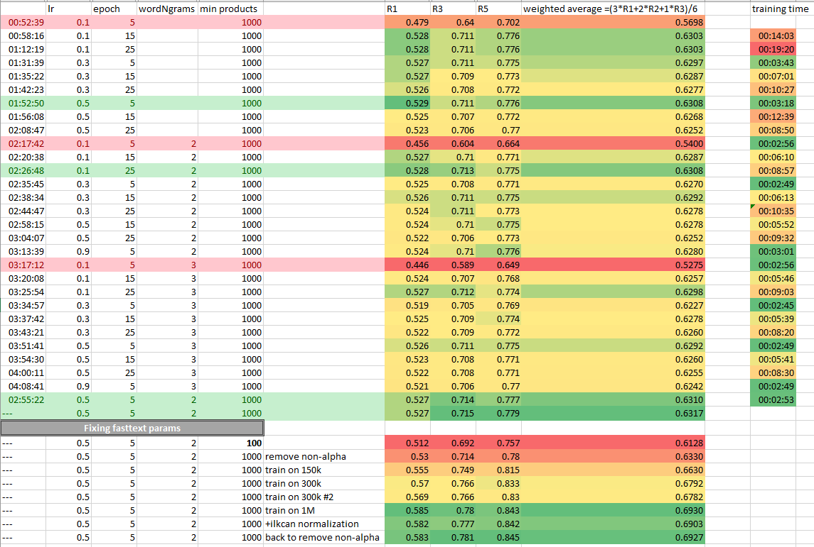

# Level 1
## Number of unique categories
min_queries | number of unique categories
---  | ---
100  | 866
1000 | 374

Output with additional logging from 'create_labeled_queries.py' with min_queries=1000 - it needed 5 iterations for multiple uplift of rare categories
```
gitpod /workspace/search_with_machine_learning_course $ python week4/create_labeled_queries.py 
4639 parent categories loaded from file /workspace/datasets/product_data/categories/categories_0001_abcat0010000_to_pcmcat99300050000.xml
1865269 queries loaded from file /workspace/datasets/train.csv
1854998 queries left after removing unknown categories
Unique categories before uplifting: 1486
Rarest categories before uplifting:
pcmcat230600050054    1
pcmcat230600050036    1
pcmcat221400050012    1
pcmcat254000050002    1
pcmcat221400050013    1
Name: category, dtype: int64
Unique categories after uplifting to min 1000 queries per category [iteration 1]: 567
Unique categories after uplifting to min 1000 queries per category [iteration 2]: 411
Unique categories after uplifting to min 1000 queries per category [iteration 3]: 379
Unique categories after uplifting to min 1000 queries per category [iteration 4]: 376
Unique categories after uplifting to min 1000 queries per category [iteration 5]: 375
Rarest categories count after uplifting:
pcmcat225700050005    1016
abcat0902001          1012
pcmcat158900050019    1008
abcat0307017          1007
pcmcat237000050015    1002
Name: category, dtype: int64
1854998 queries left after uplifting categories (should remain untouched)
1835773 queries left after removing unknown categories
1835773 queries to be saved to /workspace/fasttext/labeled_query_data.txt
```

## Best values of P@1 / R@3 / R@5
min_queries | P@1 | R@3 | R@5 | comment
----------- | --- | --- | --- | ---
100         |0.512|0.692|0.757| -
1000        |0.53 |0.714|0.78| training set size 50k
1000        |0.583|0.781|0.845| after increasing training set size to 1M (60 - 90 minutes of training)



# Level 2

## Positive examples
query           | nr of results without filtering | nr of results with filtering | predicted categories | comment
 ---            | ---                             |           ---                |     --- | ---
 qc 15          |          3373                   |           1                  | conf=0.96, All Headphones (pcmcat144700050004) | without filtering not in result set, with filtering - perfect match
 laptop         |         7734                    |         1492                 | conf=0.64, PC Laptops (pcmcat247400050000) | without filtering first laptop on 7th position
 heater         |         564                     |         99                   | conf=0.96, Air Conditioners, Fans & Heaters (abcat0907000) > Heaters (abcat0907007) | without filtering flooded by CDs

## Negative examples
query           | nr of results without filtering | nr of results with filtering | predicted categories | comment
 ---            | ---                             |           ---                |     --- | ---
 q9400          |          33                     |           0                  | conf=0.25 Movies & TV Shows (cat02015) | too low confidence threshold chosen (0.2)
 a700           |          44                     |           0                  | conf=0.25 DSLR Body & Lens (pcmcat180400050000)    | category predicted by model 'DSLR Body & Lens' is one level deeper than assigned by Best Buy 'Digital SLR Cameras (abcat0401005)', although considering match confiednce, so it can be easily fixed by increasing confidence threshold
 
 
